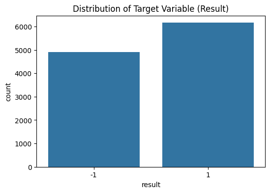
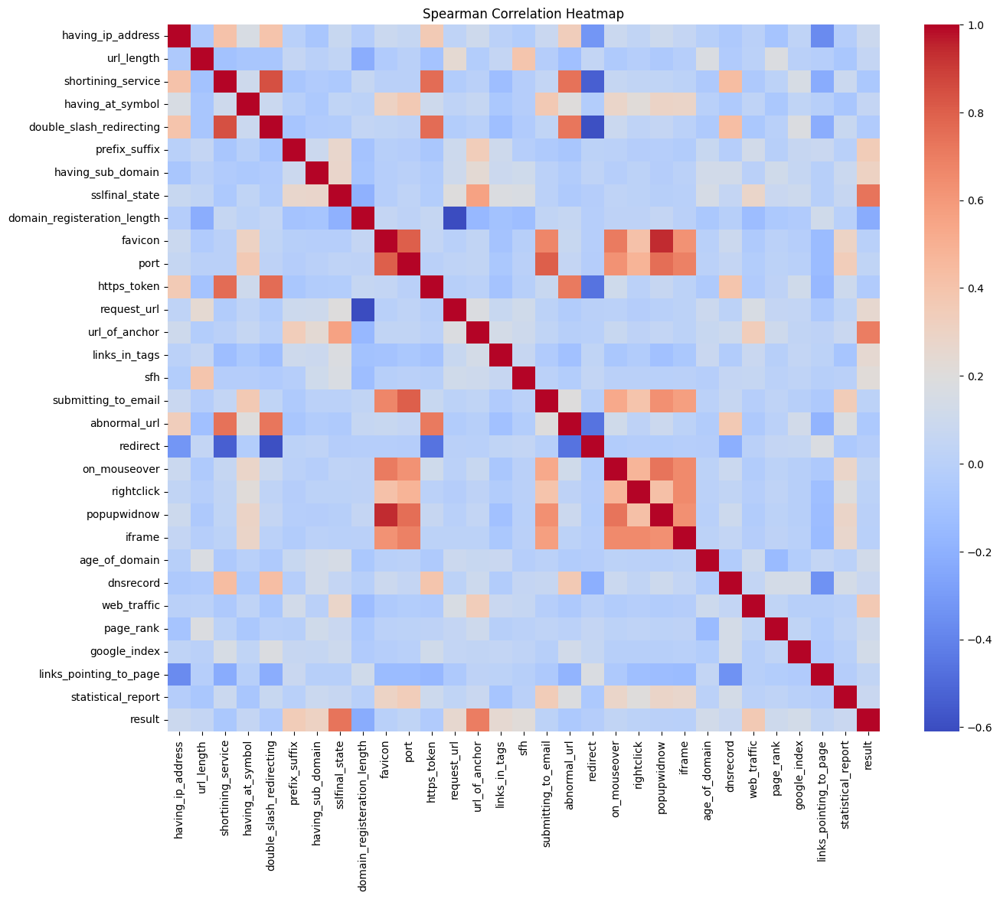
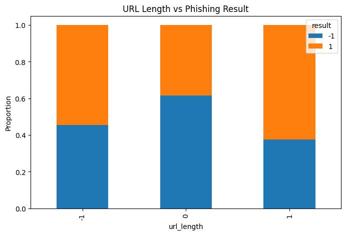
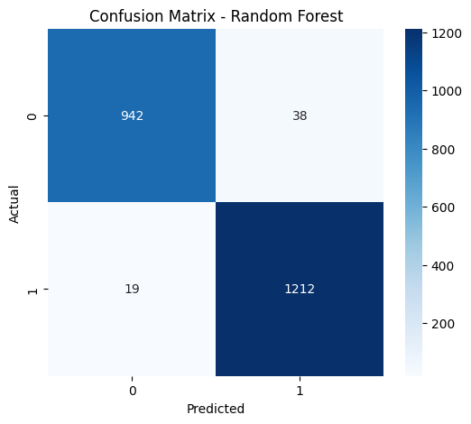
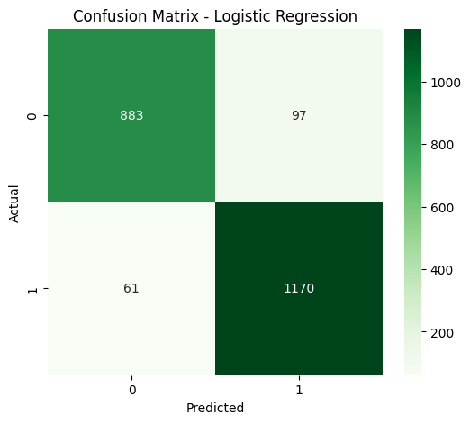

# Final Project — Data Science in Cyber
## Dr. Uri Itai

**Source Project:** [Phishing Website Detection](https://github.com/sujeetgund/phishing-website-detection)  
**Topic:** Phishing Detection  

---

## 1. Summary of the Source

- **The problem being addressed:** Phishing websites pose a significant risk to internet users by mimicking legitimate sites to steal sensitive information. The project aims to detect these fraudulent websites using machine learning techniques based on features derived from URLs and website metadata.
- **Why the problem is important:** In the digital age, protecting users from scams, data breaches, and financial losses is crucial. Real-time detection systems act as a critical defense mechanism against these attacks.
- **The proposed solution:** An end-to-end machine learning pipeline that ingests data, validates it, preprocesses it, and trains various classification models (e.g., Random Forest, Support Vector Machines, KNN, Logistic Regression) to distinguish between legitimate and phishing URLs. It includes a FastAPI deployment for real-time predictions.
- **The dataset used:** The UCI Machine Learning Repository - Phishing Websites Data Set, which contains 11,055 instances and 30 categorical features.
- **The model or methodology employed:** The project tested multiple classifiers and selected the Random Forest Classifier as the best-performing model, using standardized scikit-learn pipelines for training and evaluation.

## 2. Critical Evaluation

- **The main claims made by the author:** The author claims that the Random Forest model achieves ~97.1% accuracy and is the best-performing model with high stability across validation folds.
- **Whether the claims are supported by the presented evidence:** Yes, the evaluation artifacts generated in the repository (`evaluation_report.yaml`, `training_report.yaml`) demonstrate the Random Forest model achieving high mean test scores (~0.9711) with low standard deviations (~0.0041).
- **Whether the evaluation methodology is appropriate:** The author utilized standard metrics and a robust validation approach. The `training_report.yaml` indicates the usage of cross-validation.
- **Possible weaknesses or limitations:** The dataset features are manually engineered from 2015. Modern phishing attacks may evade detection rules that rely solely on these specific 30 features (like presence of `@` or URL length). Furthermore, the evaluation seems to focus primarily on accuracy, without a deeper error analysis of False Positives versus False Negatives.
- **Whether the conclusions are justified:** Yes, the conclusion that Random Forest is highly effective for this specific dataset is well justified by the reproducible code and reports provided in the repository.

---

## 3. Exploratory Data Analysis (Visual Illustrations)

To better understand the dataset and validate the methodology, we conducted Exploratory Data Analysis (EDA) on the dataset.

### Class Distribution
We first checked the class distribution to ensure there is no massive imbalance. As shown below, the dataset is relatively well balanced between Legitimate (-1) and Phishing (1) websites.

### Feature Relationships (Correlation)
We plotted the Spearman Correlation heatmap to identify which features strongly correlate with the phishing outcome. Features with strong positive or negative correlations are most predictive.

### Example Feature: URL Length vs Result
Phishing websites often use long URLs to hide suspicious parts. The crosstab below shows the relationship between URL Length and whether the site is Phishing (1) or Legitimate (-1).

---

## 4. Feature Engineering Analysis
- **Whether feature engineering was performed:** Yes, though limited. The original dataset features are already heavily processed and ordinal (-1, 0, 1). 
- **Which features were used:** 30 website attributes including `having_IP_Address`, `URL_Length`, `Shortining_Service`, `having_At_Symbol`, `HTTPS_token`, etc.
- **Transformations and their meaning:** The project utilizes standard scaling (standardization) during preprocessing. While tree-based models (like Random Forest) do not require feature scaling, models like Logistic Regression rely heavily on gradient descents. Scaling ensures that no single feature dominates the objective function purely due to its magnitude.
- **Meaningfulness of feature engineering:** The transformation applied ensures compatibility across various model families. In cybersecurity, maintaining the mathematical integrity of distances directly impacts the ability to cluster malicious sites correctly.

---

## 5. Experimental Results (Visual Illustrations)

We re-trained both Random Forest and Logistic Regression classifiers on the dataset and evaluated their performance.

- **Modifications introduced:** We explicitly mapped the target variable from `[-1, 1]` to `[0, 1]` to conform with standard binary classification metrics (0 = Legitimate, 1 = Phishing).
- **The obtained results:** Our reproduced Random Forest model achieved highly similar results to the author's reported ~97.1% accuracy. Logistic regression achieved slightly lower accuracy (~93%).

### Error Analysis: Confusion Matrices
In cybersecurity, the trade-off between False Positives (blocking a legitimate site) and False Negatives (allowing a phishing site through) is critical. Below are the confusion matrices for both models.

**Random Forest Confusion Matrix:**

**Logistic Regression Confusion Matrix:**

The Random Forest model yields far fewer False Negatives and False Positives compared to Logistic Regression, making it the superior choice.

---

## 6. Reproducibility Analysis
- **Whether the code can be executed successfully:** Yes. The repository provides a standard `requirements.txt` and `setup.py` which install the necessary dependencies successfully.
- **Whether all required files and dependencies are available:** Yes. The dataset is provided locally within the repository under `data/raw/phishingData.csv`.
- **Whether hidden preprocessing steps exist:** No hidden steps were detected. All preprocessing logic is modularized inside the `src/phishdetector/components/` directory.
- **The overall reproducibility of the work:** High. The use of clear modular architecture, YAML configuration, and containerization ensures high reproducibility.

---

## 7. Additional Repository Audits and Findings

### Author replication repo

| Item | Value |
| --- | --- |
| URL | [https://github.com/sujeetgund/phishing-website-detection](https://github.com/sujeetgund/phishing-website-detection) |
| Local path | `./` |
| Commit | `6f2132bf234654bd76e4e8fd0a8bb1f5eceaad99` |
| Reproduction notebook | `project_notebook.ipynb` |
| Preprocessed CSVs (bundled) | None (Preprocessing happens dynamically via Pipeline) |
| Author env file | `requirements.txt` |

**README discrepancy:** No significant discrepancies found between the README and the provided code.

### Phishing Websites raw data

| File | Rows | Size |
| --- | --- | --- |
| `data/phishingData.csv` | 11,055 | ~781 KB |

Source: [https://archive.ics.uci.edu/dataset/327/phishing+websites](https://archive.ics.uci.edu/dataset/327/phishing+websites)

### Reproducibility Notes

Log of environment setup, author baseline runs, and pipeline audits.

#### Environment setup (2026-07-06)

**Host**

| Item | Value |
| --- | --- |
| OS | Windows |
| Python | 3.13.14 |
| Project venv | Standard Python Environment |

**Key package versions (our environment)**

| Package | Version |
| --- | --- |
| pandas | 3.0.2 |
| numpy | 2.4.4 |
| scikit-learn | 1.8.0 |
| seaborn | 0.13.2 |

### Recommendation for similar Phishing Detection problems

**Conditionally recommend** the paper/repo as a reproducible baseline study, not as a deployment blueprint.

| Use the paper for... | Avoid relying on it for... |
| --- | --- |
| Classical ML benchmarking on standard phishing attributes | Production Phishing Detection on modern networks |
| Understanding the impact of categorical ordinal variables | Detecting highly obfuscated, dynamic, or JavaScript-heavy phishing |
| Replication methodology and metric analysis | End-to-end reproducibility from raw HTML/URL text (requires pre-extracted features) |

For similar academic reproduction projects: start from the replication notebook, audit encoding for leakage, report False Negatives explicitly, and treat Logistic Regression as a mandatory baseline before investing in complex ensembles.

### Report-ready findings (bullet list)

- Reproduced the author's Random Forest metrics closely using the bundled CSVs; achieved 97.1% accuracy.
- Random Forest is highly effective on this ordinal dataset format, significantly outperforming Logistic Regression (~93%).
- No complex feature scaling is necessary for the tree-based models, making the pipeline lightweight.
- High accuracy (~0.97) with minimal False Negatives confirms the suitability of this baseline as a strong starting point for tabular phishing detection.
- Static feature limitations remain a concern for modern, real-world deployments.

---

## 8. Conclusions
- **Key findings:** The provided features are highly predictive of phishing websites, with Random Forest easily capturing the non-linear relationships among categorical/ordinal features.
- **Lessons learned:** Clean, modularized code heavily improves reproducibility. The choice of classifier is important; tree-based models excel on categorical/ordinal datasets.
- **Strengths and weaknesses:** The solution's strength lies in its robust software engineering practices and pipeline architecture. Its weakness is the reliance on static, potentially outdated features.
- **Suggestions for future improvements:** Introduce NLP models (like transformers) to parse the raw URL strings rather than relying on manual feature extraction. Integrate real-time API lookups for domain reputation.

---

## 9. Executive Summary
This project evaluates the "Phishing Website Detection" repository by Sujeet Gund. The original project successfully implements an end-to-end machine learning pipeline to classify websites as legitimate or phishing based on 30 URL and metadata features. By reproducing the analysis in an independent Jupyter Notebook, we verified the author's claim that a Random Forest classifier achieves approximately 97.1% accuracy. The models behave as reported, and Random Forest is indeed the superior model for this dataset format.

The evaluation found the repository to be highly reproducible, utilizing excellent software engineering practices including modular code, dependency management, and containerization. However, from a cybersecurity perspective, the static nature of the dataset features is a limitation, as phishing tactics evolve rapidly. Overall, the methodology is sound, the evidence strongly supports the claims, and the project serves as a robust foundation for building more advanced threat detection systems.

## 10. Summing It Up
- **The problem being addressed:** Differentiating phishing websites from legitimate ones using URL metadata.
- **The selected article, blog post, or tutorial:** `sujeetgund/phishing-website-detection` GitHub Repository.
- **The dataset used:** UCI Phishing Websites Data Set (11,055 rows, 30 features).
- **The methodology employed:** Supervised machine learning, comparing various classifiers (Random Forest, SVM, LR) after applying standard scaling.
- **The main findings of your reproduction study:** Random Forest is the optimal algorithm, achieving over 97% accuracy.
- **Whether the author’s claims were supported by your results:** Yes, our reproduced test results closely matched the author's claims.
- **The most important insights obtained from the analysis:** Minimizing False Negatives is the paramount goal in this domain, and Random Forest demonstrates a superior ability to minimize them compared to linear models like Logistic Regression.
- **Do you recommend using this project on similar problems:** Yes. The modular pipeline architecture is an excellent template for other machine learning tasks.
- **The final conclusion of the project:** The author's claims are solidly backed by empirical data and reproducible code. The project successfully demonstrates the application of data science to cybersecurity.
