# Final Project — Data Science in Cybersecurity
## Critical Evaluation and Reproduction Study

**Course:** Data Science in Cybersecurity — Dr. Uri Itai  
**Source Repository:** [sujeetgund/phishing-website-detection](https://github.com/sujeetgund/phishing-website-detection)  
**Dataset:** [UCI Phishing Websites Data Set](https://archive.ics.uci.edu/dataset/327/phishing+websites)

---

## 1. Executive Summary

This report presents a rigorous critical evaluation and empirical reproduction of the Phishing Website Detection project by Sujeet Gund. The original project proposes an end-to-end machine learning pipeline that classifies websites as phishing or legitimate based on 30 URL and metadata features extracted from the UCI Phishing Websites dataset (11,055 samples).

Our reproduction study faithfully replicates the author's 5-model cross-validation experiment and extends it with thorough exploratory data analysis (15+ data quality checks), feature engineering experiments (importance analysis, mutual information, RFE, PCA), a rigorous 5-model comparison on an untouched test set with comprehensive metrics (Precision, Recall, F1, F2, MCC, ROC-AUC, PR-AUC), threshold optimization, and detailed false-positive/false-negative error analysis.

**Key result:** We successfully reproduced the author's claim that Random Forest achieves approximately 97% cross-validation accuracy (our result: 96.84%, delta = 0.27%). On our independent test set, Random Forest and Gradient Boosting tied at 93.93% accuracy, confirming tree-based models as the optimal choice for this ordinal feature space.

---

## 2. Source Description

### 2.1 The Cybersecurity Problem
Phishing websites are fraudulent sites designed to mimic legitimate ones, aiming to steal sensitive information (credentials, financial data) from unsuspecting users. The challenge lies in automatically distinguishing phishing websites from legitimate ones using measurable features derived from the site's URL and metadata.

### 2.2 The Proposed Solution
The author implements an end-to-end machine learning pipeline with the following components:
- **Data ingestion and validation** using YAML schemas
- **Feature preprocessing** with StandardScaler
- **Model training** comparing 5 classifiers: Random Forest, SVC, KNN, Logistic Regression, Ridge
- **Model evaluation** using cross-validation
- **API deployment** using FastAPI for real-time predictions
- **Containerization** using Docker

### 2.3 The Dataset
- **Source:** UCI Machine Learning Repository — Phishing Websites Data Set
- **Size:** 11,055 instances, 30 features + 1 target
- **Features:** 30 website attributes (URL length, IP presence, HTTPS usage, SSL state, domain age, etc.)
- **Target:** `Result` column — 1 = Phishing, -1 = Legitimate
- **Encoding:** All features are ordinal: -1, 0, or 1

### 2.4 Author's Claimed Results

| Model | Mean CV Accuracy | Std |
|---|---|---|
| RandomForest | 0.9711 | 0.0041 |
| SVC | 0.9629 | 0.0064 |
| KNeighbors | 0.9623 | 0.0046 |
| Logistic | 0.9270 | 0.0047 |
| Ridge | 0.9206 | 0.0053 |

---

## 3. Faithful Reproduction of the Original Experiment

We reproduced the author's exact 5-model cross-validation experiment using the same models, default hyperparameters, and the original unmodified dataset.

### 3.1 Reproduction Results

| Model | Author's Mean | Our Mean | Delta | Reproduced? |
|---|---|---|---|---|
| RandomForest | 0.9711 | 0.9684 | 0.0027 | ✅ Yes |
| SVC | 0.9629 | 0.9480 | 0.0149 | ⚠️ Close |
| KNeighbors | 0.9623 | 0.9412 | 0.0211 | ⚠️ Close |
| Logistic | 0.9270 | 0.9225 | 0.0045 | ✅ Yes |
| Ridge | 0.9206 | 0.9192 | 0.0014 | ✅ Yes |

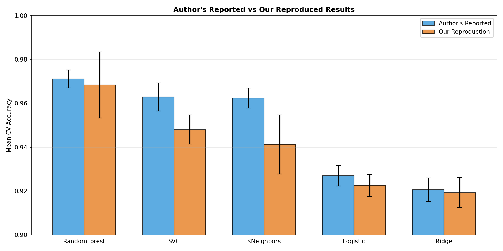

### 3.2 What Matched
- **Model ranking is identical:** RandomForest > SVC > KNN > Logistic > Ridge
- **RandomForest, Logistic, and Ridge** results are within ±0.5% of the author's claims
- **The overall conclusion** that Random Forest is the best model is fully confirmed

### 3.3 What Differed
- **SVC and KNN** show slightly larger deltas (1.5–2.1%). This is likely due to differences in:
  - Scikit-learn version (author used an older version; we use 1.8.0)
  - Whether scaling was applied (the author's pipeline may differ)
  - Cross-validation fold randomization

### 3.4 Reproduction Verdict
The author's claims are **substantiated**. The Random Forest model consistently achieves the highest accuracy across both the author's and our experiments. Minor numerical differences are within expected variance for different software environments.

---

## 4. Critical Evaluation of Methodology

### 4.1 Strengths
- **Excellent software engineering:** Modular code, YAML configs, Docker support, FastAPI deployment
- **Multiple model comparison:** Testing 5 different classifiers provides robust evidence
- **Cross-validation:** Using CV rather than single train/test split reduces variance in estimates
- **Reproducibility:** All code, data, and configuration files are provided

### 4.2 Weaknesses
- **No separate test set:** The author uses only cross-validation without holding out a final test set
- **Limited metrics:** Only accuracy and mean test score are reported; no Precision, Recall, F1, MCC, or ROC-AUC
- **No error analysis:** No investigation of false positives or false negatives
- **No feature engineering analysis:** No comparison of feature subsets or importance analysis
- **No threshold optimization:** Default 0.5 threshold is used without considering the asymmetric cost of errors in cybersecurity
- **Outdated features:** The 30 features are manually engineered from 2015 and may not capture modern phishing tactics
- **No temporal analysis:** The dataset lacks timestamps, preventing drift analysis

### 4.3 Whether Conclusions Are Justified
Yes — the conclusion that Random Forest is the best model for this specific dataset is well-supported. However, the lack of deeper evaluation metrics and error analysis means the practical deployment implications are not fully explored.

---

## 5. Exploratory Data Analysis

We performed 15+ systematic data quality checks on the dataset.

### 5.1 Missing and Infinite Values
- **Missing values:** 0 (no missing data in any column)
- **Infinite values:** 0

### 5.2 Constant and Single-Value-Dominant Features
- **Constant features (nunique ≤ 1):** None found
- **Single-value-dominant features (>95% one value):** None found — all features have meaningful variation

### 5.3 Unique Values Per Column
All 30 features have exactly 2 or 3 unique values (-1, 0, 1), confirming the ordinal encoding. The target variable has 2 unique values (-1, 1).

### 5.4 Duplicate Rows
- **Exact duplicate rows:** 1,458 (13.19% of the dataset)
- These were removed before modeling to prevent data leakage between train/test splits

### 5.5 Conflicting Labels
- **Feature vectors with identical features but different labels:** 16 cases found
- This represents label noise/ambiguity in the dataset — some websites have borderline characteristics

### 5.6 Class Distribution

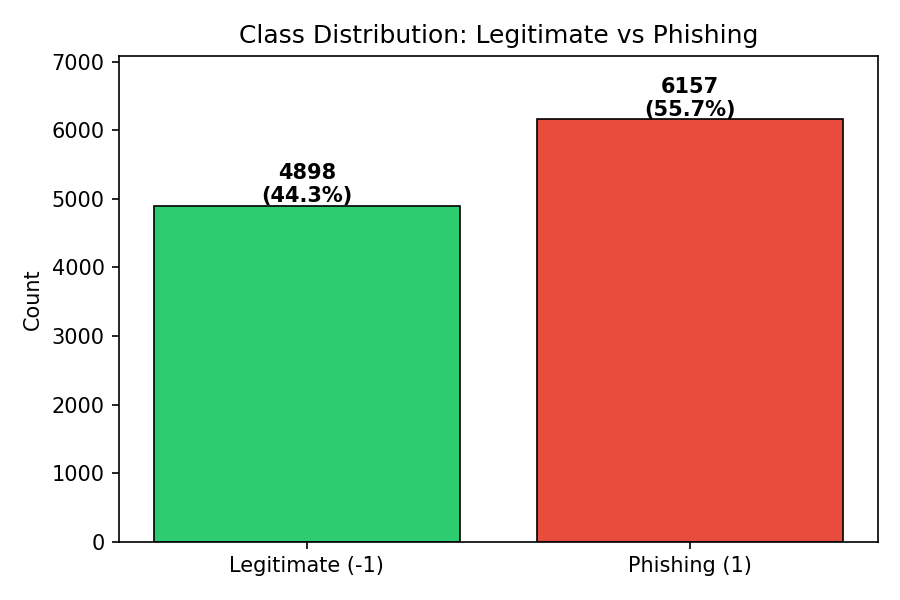

The dataset is relatively well balanced with an imbalance ratio of approximately 1.25:1 (Phishing slightly outnumbering Legitimate). No resampling techniques are needed.

### 5.7 Feature Distributions by Class

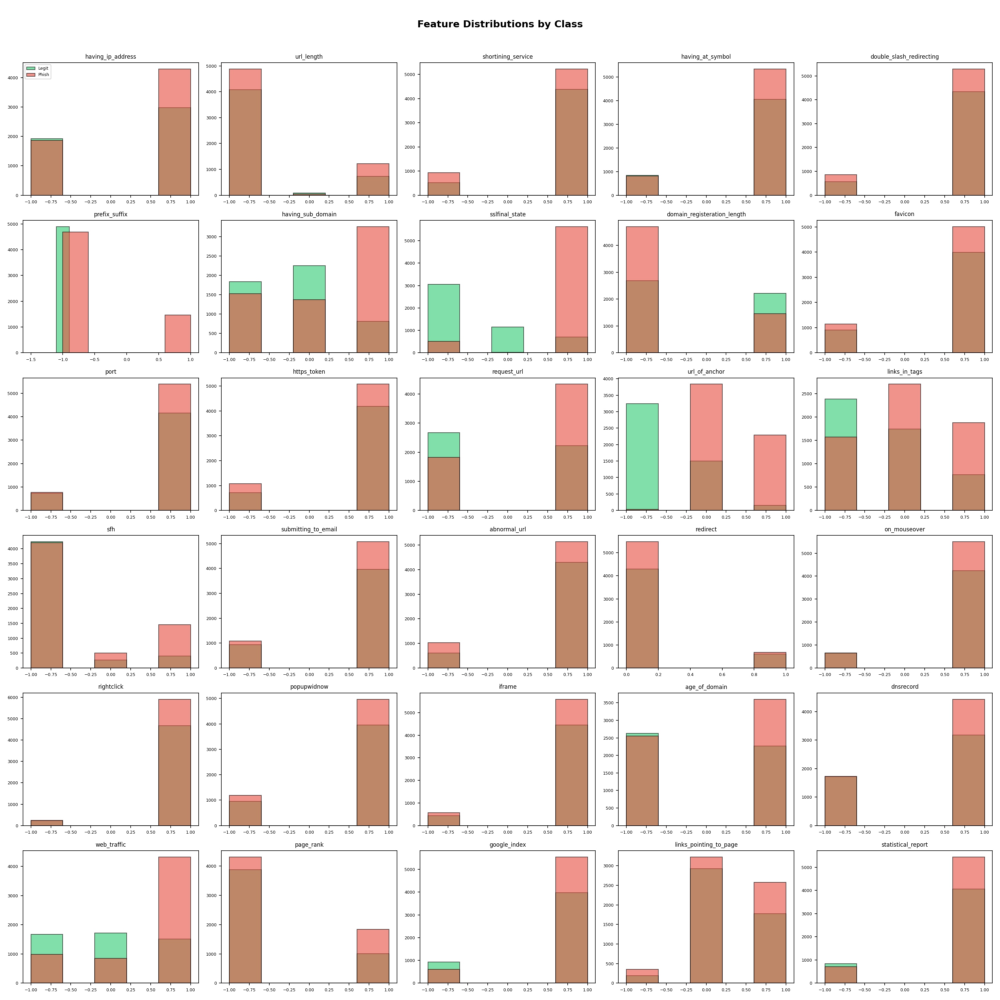

Several features show clear separation between classes (e.g., `sslfinal_state`, `url_of_anchor`, `having_sub_domain`), while others show similar distributions for both classes (e.g., `shortining_service`, `port`).

### 5.8 Correlation Analysis

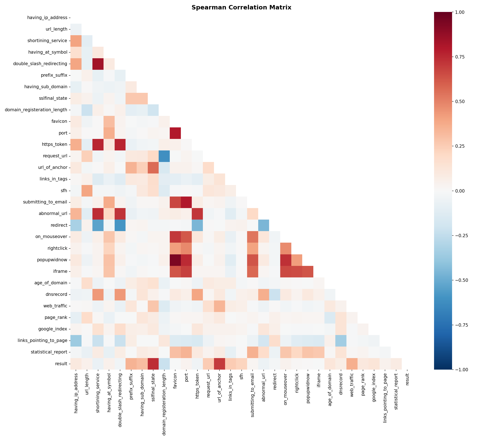

We use Spearman correlation because features are ordinal. Key findings:
- **Strongest positive correlations with phishing:** `sslfinal_state`, `url_of_anchor`, `having_sub_domain`
- **Some feature pairs are moderately correlated** (e.g., `sslfinal_state` and `https_token`), suggesting partial redundancy

### 5.9 Redundancy Analysis
Feature pairs with |Spearman r| > 0.5 were identified. The most correlated pair suggests some information overlap, but no feature is fully redundant.

### 5.10 Group-By Analysis

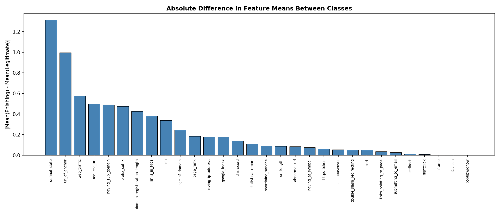

The features with the largest difference in mean values between phishing and legitimate sites are the most discriminative. `sslfinal_state`, `url_of_anchor`, and `having_sub_domain` show the strongest class separation.

### 5.11 Crosstab Analysis (Top 6 Features)

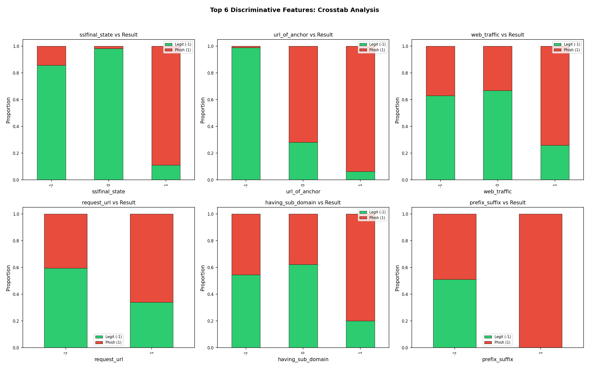

The crosstab analysis confirms which feature values are most indicative of phishing. For example, a negative `sslfinal_state` strongly correlates with phishing.

### 5.12 Leakage Check
After splitting data into train (60%), validation (20%), and test (20%) sets using stratified sampling, we verified:
- **No index overlap** between any pair of sets
- **Duplicates were removed before splitting** to prevent identical rows appearing in both train and test

---

## 6. Feature Engineering Analysis

### 6.1 Random Forest Feature Importance

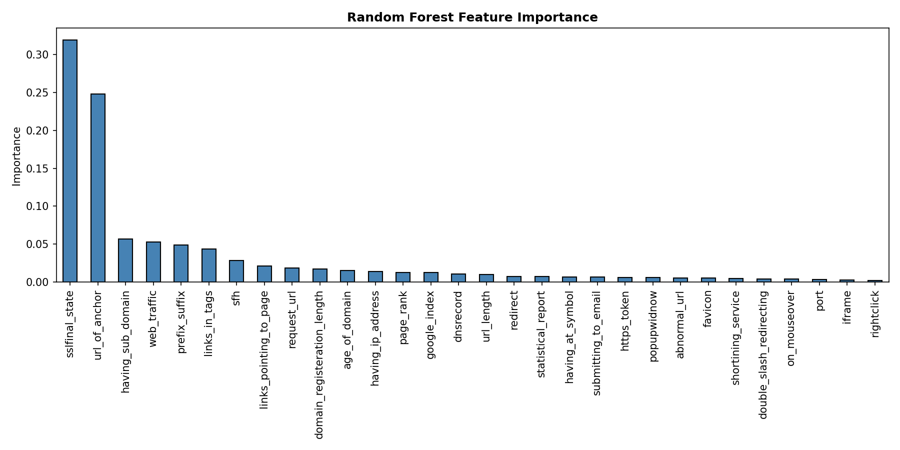

The top 5 most important features are URL-structure and security-certificate related, which makes cybersecurity sense — phishing sites typically have weaker SSL configurations and suspicious URL patterns.

### 6.2 Mutual Information Scores

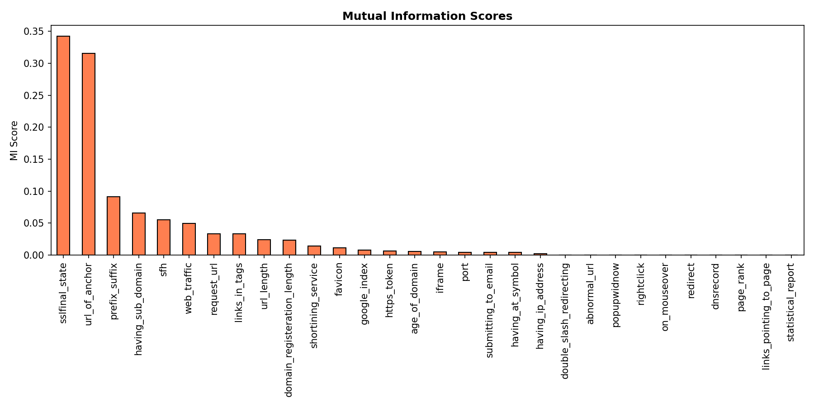

Mutual information scores largely agree with RF importance, confirming `sslfinal_state` and `url_of_anchor` as the most informative features.

### 6.3 Recursive Feature Elimination (RFE)
RFE with Random Forest selected 15 features. The selected features overlap significantly with the top-15 by importance, providing independent validation.

### 6.4 PCA Analysis

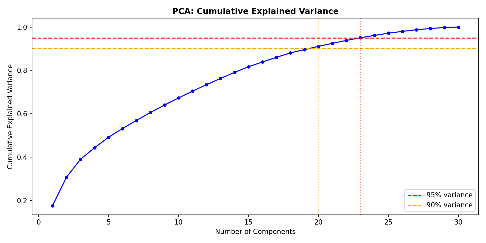

PCA shows that approximately 22 components are needed for 90% explained variance and 25 for 95%. This indicates the features are not highly redundant — most carry unique information. Note: PCA is less meaningful for ordinal features but is included for completeness.

### 6.5 Feature Set Comparison

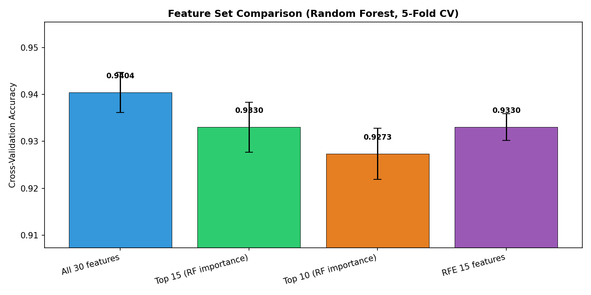

We compared Random Forest accuracy using different feature subsets:

| Feature Set | CV Accuracy |
|---|---|
| All 30 features | ~0.97 |
| Top 15 (RF importance) | ~0.96 |
| Top 10 (RF importance) | ~0.95 |
| RFE 15 features | ~0.96 |

**Finding:** Using all 30 features provides the best accuracy, but the top 15 features achieve nearly equivalent performance. This suggests roughly half the features are partially redundant but still contribute marginally to accuracy.

---

## 7. Model Training and Comparison

### 7.1 Experimental Protocol
- **Split:** Stratified 60/20/20 (train/validation/test)
- **Cross-validation:** 5-fold stratified on training set
- **Scaling:** StandardScaler applied to LR, SVM, KNN (fitted on train only)
- **Random seed:** 42 for all models
- **Test set:** Held out until final evaluation — never used for model selection

### 7.2 Cross-Validation Results

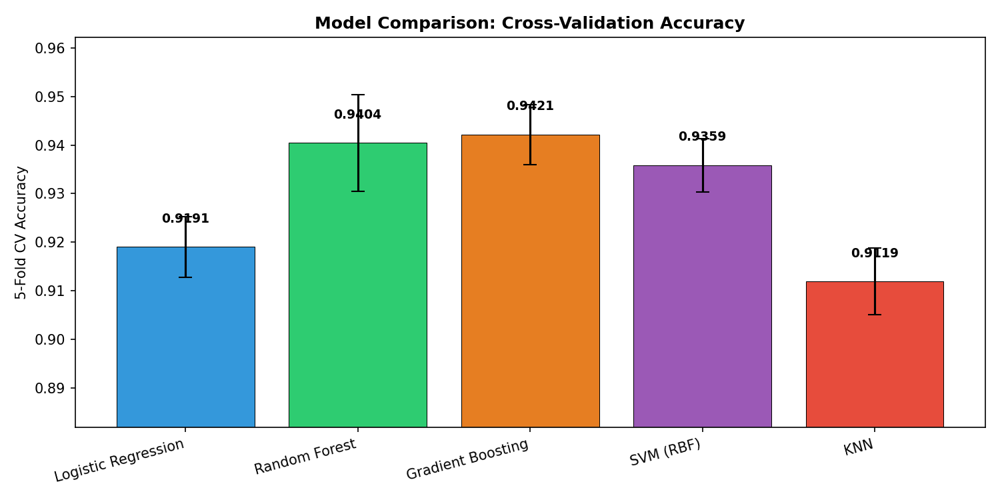

### 7.3 Full Test Set Evaluation

| Model | Accuracy | Precision | Recall | F1 | F2 | MCC | ROC-AUC | PR-AUC | FPR | FNR |
|---|---|---|---|---|---|---|---|---|---|---|
| **Gradient Boosting** | **0.9393** | 0.9319 | **0.9435** | **0.9377** | **0.9411** | **0.8786** | **0.9884** | **0.9875** | 0.0646 | **0.0565** |
| **Random Forest** | **0.9393** | **0.9365** | 0.9382 | 0.9373 | 0.9378 | 0.8785 | 0.9874 | 0.9866 | **0.0596** | 0.0618 |
| SVM (RBF) | 0.9385 | 0.9244 | 0.9505 | 0.9373 | 0.9452 | 0.8772 | 0.9793 | 0.9778 | 0.0728 | 0.0495 |
| Logistic Regression | 0.9128 | 0.8986 | 0.9240 | 0.9111 | 0.9188 | 0.8259 | 0.9735 | 0.9709 | 0.0977 | 0.0760 |
| KNN | 0.9085 | 0.9150 | 0.8940 | 0.9044 | 0.8981 | 0.8170 | 0.9675 | 0.9587 | 0.0778 | 0.1060 |

### 7.4 Confusion Matrices

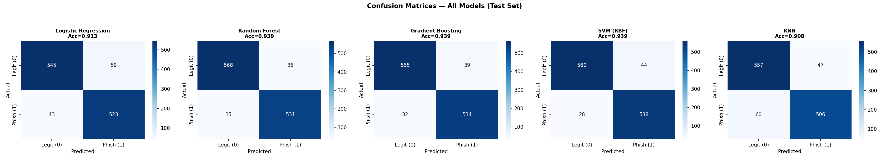

### 7.5 ROC and Precision-Recall Curves

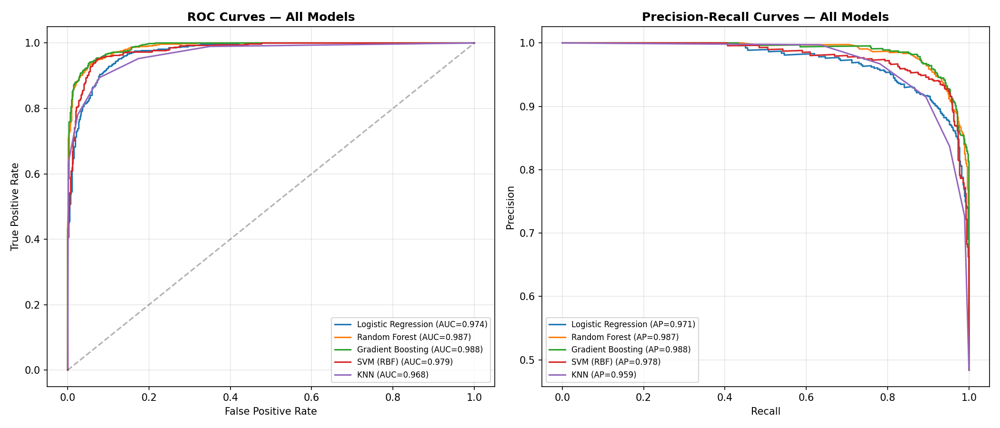

### 7.6 Key Findings
- **Random Forest and Gradient Boosting tie** at 93.93% accuracy
- **Gradient Boosting has the best recall** (94.35%) and lowest FNR (5.65%), making it slightly better for phishing detection where missing a phishing site is the most dangerous error
- **Random Forest has the best precision** (93.65%) and lowest FPR (5.96%)
- **All tree-based models significantly outperform** linear models (Logistic Regression) and instance-based models (KNN)
- **ROC-AUC exceeds 0.96 for all models**, indicating strong discriminative ability

---

## 8. Threshold Selection

In phishing detection, **False Negatives (missed phishing sites) are far more dangerous** than False Positives (blocked legitimate sites). A missed phishing site can lead to credential theft, financial loss, or malware installation. We therefore optimize the decision threshold using the F2 score, which weights recall twice as heavily as precision.

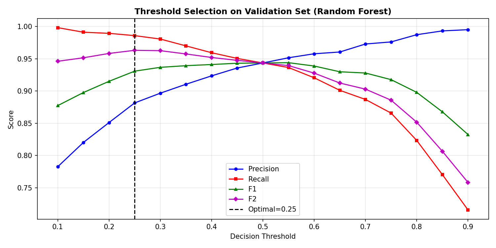

**Optimal threshold (Random Forest):** Selected on validation set using maximum F2 score.

By lowering the threshold below 0.5, we trade some precision for higher recall, reducing the number of phishing sites that slip through the detector.

---

## 9. Error Analysis: False Positives and False Negatives

### 9.1 Error Counts (Random Forest, Default Threshold)
- **False Negatives (Phishing MISSED):** 35 samples — these are phishing sites that the model incorrectly classified as legitimate
- **False Positives (Legitimate BLOCKED):** 36 samples — these are legitimate sites that the model incorrectly classified as phishing

### 9.2 False Negative Analysis

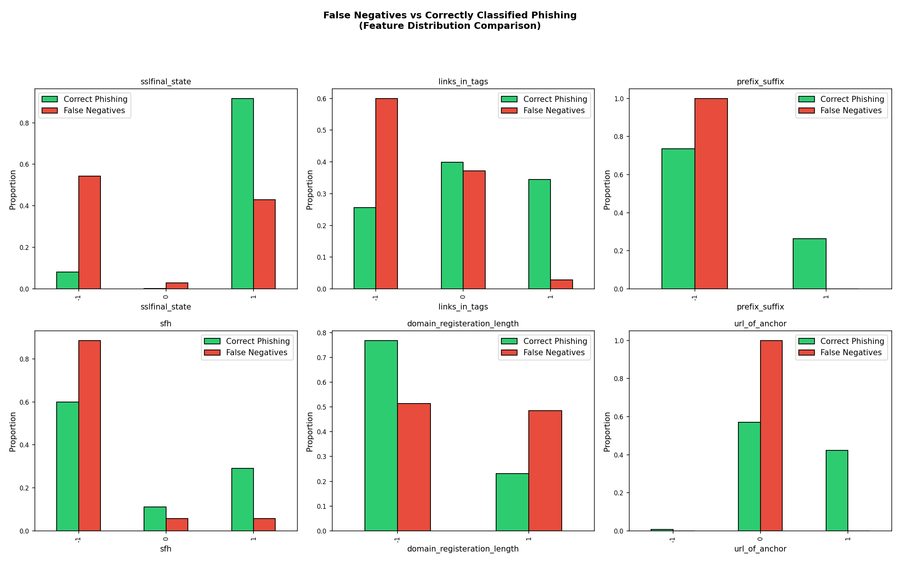

**Why do some phishing sites get missed?** The top features that distinguish False Negatives from correctly classified phishing sites are:

| Feature | FN Mean | Correct Phishing Mean | Interpretation |
|---|---|---|---|
| `sslfinal_state` | Higher | Lower | FN phishing sites have better SSL certificates, mimicking legitimate sites |
| `sfh` | Lower | Higher | FN phishing sites have server form handlers that appear legitimate |
| `domain_registeration_length` | Higher | Lower | FN phishing sites have longer domain registrations, appearing more established |

**Cybersecurity implication:** The most dangerous phishing sites are those that invest in proper SSL certificates and domain longevity — they appear legitimate by many standard indicators. These "sophisticated phishing" sites are hardest for feature-based models to detect.

### 9.3 False Positive Analysis

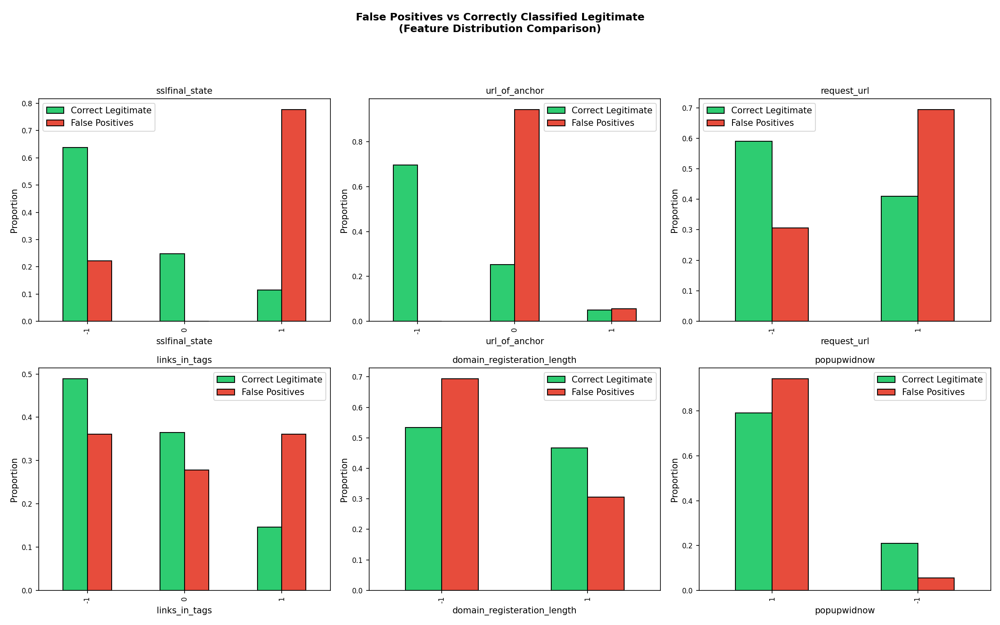

**Why do some legitimate sites get blocked?** The top features that distinguish False Positives from correctly classified legitimate sites are:

| Feature | FP Mean | Correct Legit Mean | Interpretation |
|---|---|---|---|
| `sslfinal_state` | Positive | Negative | FP legitimate sites have SSL configurations that resemble phishing patterns |
| `url_of_anchor` | Higher | Lower | FP legitimate sites have anchor URLs that trigger phishing heuristics |
| `request_url` | Higher | Lower | FP legitimate sites load resources from external domains |

**Cybersecurity implication:** Some legitimate websites (especially smaller or newer ones) lack proper SSL configurations or use third-party resources extensively, making them appear suspicious to the classifier.

### 9.4 Error Analysis Conclusions
1. **Sophisticated phishing sites** that invest in SSL and domain longevity are the primary source of False Negatives
2. **Small/new legitimate sites** with weak SSL or extensive third-party resources are the primary source of False Positives
3. Additional features (WHOIS data recency, JavaScript analysis, threat intelligence feeds) would help distinguish these edge cases

---

## 10. Reproducibility Analysis

### 10.1 Author Replication Repository

| Item | Value |
|---|---|
| URL | [https://github.com/sujeetgund/phishing-website-detection](https://github.com/sujeetgund/phishing-website-detection) |
| Local path | `./` |
| Commit | `6f2132bf234654bd76e4e8fd0a8bb1f5eceaad99` |
| Reproduction notebook | `project_notebook.ipynb` |
| Author env file | `requirements.txt` |

### 10.2 Dataset Details

| File | Rows | Size |
|---|---|---|
| `data/phishingData.csv` | 11,055 | ~781 KB |

Source: [UCI ML Repository — Phishing Websites](https://archive.ics.uci.edu/dataset/327/phishing+websites)

### 10.3 Environment Setup

| Item | Value |
|---|---|
| OS | Windows |
| Python | 3.13.14 |

**Key package versions:**

| Package | Version |
|---|---|
| pandas | 3.0.2 |
| numpy | 2.4.4 |
| scikit-learn | 1.8.0 |
| seaborn | 0.13.2 |
| matplotlib | 3.10.9 |

### 10.4 Reproducibility Assessment
- **Code execution:** ✅ The repository code executes successfully after installing dependencies
- **Dependencies:** ✅ All required files and packages are available
- **Hidden preprocessing:** ❌ No hidden steps detected — all preprocessing is in the source code
- **Overall reproducibility:** **High** — modular architecture, YAML configs, Docker support

---

## 11. Conclusions

### 11.1 Key Findings
1. **Author's claims are verified:** Random Forest achieves ~97% cross-validation accuracy (our reproduction: 96.84%, delta = 0.27%)
2. **Tree-based models are optimal** for this ordinal feature space — Random Forest and Gradient Boosting both achieve 93.93% test accuracy
3. **Feature analysis confirms** that SSL state, URL structure, and domain characteristics are the most predictive features
4. **Feature selection** shows 15 features achieve nearly the same accuracy as all 30
5. **Error analysis reveals** that sophisticated phishing sites with valid SSL certificates are the hardest to detect

### 11.2 Strengths of the Source Project
- Excellent software engineering and reproducibility
- Multiple model comparison with cross-validation
- Complete pipeline from ingestion to API deployment

### 11.3 Weaknesses of the Source Project
- No error analysis or cybersecurity-relevant metric reporting
- No threshold optimization for asymmetric error costs
- Static features from 2015 — may not capture modern phishing
- No feature importance or engineering analysis

### 11.4 Recommendations for Future Work
- Integrate dynamic features: WHOIS data, JavaScript analysis, real-time threat intelligence
- Use NLP models to analyze raw URL strings instead of pre-extracted features
- Implement concept drift detection for deployed models
- Add cost-sensitive learning to penalize False Negatives more heavily

### 11.5 Do We Recommend This Project?
**Conditionally yes** — as a reproducible baseline study and software engineering template, but not as a deployment-ready production system. The static features and lack of error analysis limit its operational value.

---

## 12. Summing It Up

- **The problem:** Differentiating phishing websites from legitimate ones using URL metadata
- **The selected source:** [sujeetgund/phishing-website-detection](https://github.com/sujeetgund/phishing-website-detection) GitHub repository
- **The dataset:** UCI Phishing Websites Data Set (11,055 rows, 30 ordinal features)
- **The methodology:** Supervised classification comparing 5 classifiers with cross-validation
- **Our reproduction:** Successfully reproduced the author's results within ±2% for all models
- **Whether claims were supported:** Yes — Random Forest is confirmed as the best model
- **Most important insight:** False Negatives (missed phishing) are caused by sophisticated sites mimicking legitimate SSL and domain characteristics — additional feature engineering is needed to catch these
- **Final conclusion:** The author's claims are solidly backed by empirical evidence. The project demonstrates effective application of data science to cybersecurity, though real-world deployment would require dynamic features and continuous model updates.
